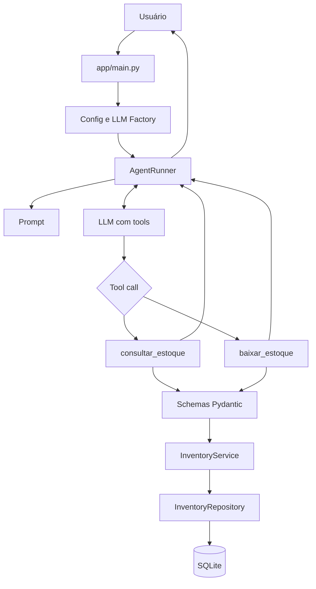

# Agente de controle de estoque com Tool Calling

Agente de terminal que interpreta solicitações em linguagem natural e usa ferramentas para consultar ou baixar produtos de um estoque SQLite. A orquestração usa LangChain e a LLM é criada por uma factory, mantendo o restante da aplicação desacoplado do provedor.

O projeto demonstra tool calling explícito, arquitetura em camadas, validação de argumentos, proteções de estoque, timeout e retry, tracing e avaliação com um golden set de 22 perguntas.

## Funcionalidades

| Ferramenta | Finalidade | Argumentos |
|---|---|---|
| `consultar_estoque` | Consultar sem alterar dados | `name: str` |
| `baixar_estoque` | Retirar unidades de um produto | `name: str`, `quantity: int > 0` |

Exemplos:

```text
Quantos teclados existem no estoque?
Dê baixa de 2 mouses.
Tem monitor disponível?
```

O agente também recusa perguntas fora do domínio e baixas com quantidade zero ou negativa.

## Arquitetura

O fluxo principal é `agent -> tools -> schemas/services -> repository -> database`.



### Estrutura do projeto

```text
app/
├── agent/
│   ├── agentRunner.py          # loop de tool calling, limites e trace
│   └── prompts.py              # prompt e regras do agente
├── core/
│   ├── config.py               # leitura e validação do ambiente
│   └── llm_factory.py          # criação da LLM por provedor
├── db/
│   ├── database.py             # engine e sessões SQLAlchemy
│   ├── models.py               # modelo e constraints
│   └── seed.py                 # carga inicial
├── repositories/
│   └── inventory_repository.py # persistência
├── schemas/
│   └── inventory.py            # validação dos argumentos das tools
├── services/
│   └── inventory_services.py   # regras de negócio
├── tools/
│   └── inventory.py            # capacidades expostas à LLM
└── main.py                     # interface de terminal

evals/
├── golden_set.json             # 22 casos de avaliação
└── run_golden_set.py           # executor, critérios e métricas

tests/
└── test_golden_set.py          # testes do avaliador

relatorio_comparativo-DOIS TESTES FEITOS INICIALMENTE.md
                                # comparação das execuções
```

## Responsabilidades das camadas

### Entrada da aplicação

`app/main.py` inicializa o banco, carrega a configuração, solicita uma LLM à factory e cria o `AgentRunner`. Depois mantém o terminal ativo até o usuário digitar `sair` ou interromper o processo.

### Configuração

`app/core/config.py` carrega o `.env` da raiz e exige:

- `LLM_PROVIDER`: provedor usado pela factory;
- `LLM_MODEL`: modelo enviado ao provedor.

A OpenAI lê a credencial de `OPENAI_API_KEY`. Segredos não devem ser colocados no código ou versionados.

### LLM Factory

`app/core/llm_factory.py` centraliza a criação da LLM:

```python
llm = create_llm(provider="openai", model="gpt-5-nano")
```

O restante da aplicação depende de `BaseChatModel`, e não diretamente de `ChatOpenAI`. Assim, modelo, timeout, retry e implementação do provedor ficam concentrados em um único lugar.

Atualmente apenas `openai` está implementado. Outro provedor deve ser adicionado à factory com sua dependência e credencial, retornando um chat model compatível com tool calling.

### Prompt

`app/agent/prompts.py` define capacidades e restrições:

- nunca inventar estoque;
- consultar ou alterar somente por ferramentas;
- baixar apenas mediante solicitação explícita;
- recusar zero ou negativos sem chamar ferramentas;
- não declarar sucesso depois de erro;
- responder apenas sobre estoque;
- usar nomes no singular nesta base de demonstração.

O prompt orienta o modelo, mas não substitui validações determinísticas.

### AgentRunner

O `AgentRunner` executa o ciclo:

1. Formata as mensagens de sistema e usuário.
2. Invoca o modelo.
3. Se não houver tool call, retorna a resposta final.
4. Se houver, valida e executa a ferramenta solicitada.
5. Adiciona o resultado como `ToolMessage` ao histórico.
6. Invoca novamente o modelo para interpretar o resultado.

`run(question)` retorna o texto final. `run_with_trace(question)` retorna um `AgentRun` com resposta e trace estruturado.

Proteções do runner:

- a mesma baixa, com produto e quantidade idênticos, não é executada duas vezes na mesma solicitação;
- no máximo cinco ferramentas são executadas por solicitação; a sexta é bloqueada e registrada como `tool_limit_reached`.

### Schemas

Os schemas Pydantic validam argumentos produzidos pela LLM:

- nomes precisam ser strings não vazias;
- espaços externos são removidos;
- a quantidade deve ser um inteiro estrito maior que zero.

Assim, mesmo que o modelo desobedeça ao prompt, uma quantidade inválida é bloqueada.

### Ferramentas

As funções em `app/tools/inventory.py` são adaptadores finos: abrem a sessão, constroem serviço e repositório e formatam o resultado. Regras de negócio não ficam nas ferramentas.

### Serviço

`InventoryService` garante que o produto exista e que uma baixa nunca supere o estoque disponível. Falhas são retornadas explicitamente.

### Repositório

`InventoryRepository` concentra consultas e alterações SQLAlchemy. A busca ignora maiúsculas e espaços externos, mas exige correspondência do nome completo. Não há fuzzy matching ou normalização genérica de plural.

### Banco de dados

O SQLite fica em `data/stock.db`. A tabela `products` contém `id`, nome único e quantidade, além da constraint `quantity >= 0`.

O seed inicial é:

| Produto | Quantidade |
|---|---:|
| Teclado | 10 |
| Mouse | 20 |
| Monitor | 5 |

O seed só insere os produtos quando a tabela está vazia.

## 🚩 Timeout, retry e recuo exponencial
> [!WARNING]
> As chamadas à LLM possuem timeout de 30 segundos e até dois retries com recuo exponencial (com uma observação).

A factory configura:

```python
ChatOpenAI(
    model=model,
    timeout=30,
    max_retries=2,
)
```

`timeout=30` limita cada tentativa a 30 segundos. `max_retries=2` permite a tentativa inicial e até duas novas tentativas para falhas recuperáveis, como determinadas falhas de conexão, rate limit e erros transitórios do servidor.

O SDK usado pelo `ChatOpenAI` aplica recuo exponencial com jitter. Na versão utilizada no desenvolvimento, a espera começa em aproximadamente 0,5 segundo, cresce exponencialmente e tem teto de 8 segundos. Quando a API fornece uma orientação válida como `Retry-After`, o cliente pode respeitá-la.

```text
tentativa inicial
    └── falhou → espera ~0,5 s + jitter
        └── retry 1 falhou → espera ~1 s + jitter
            └── retry 2
```

Não existe outro loop de retry no `AgentRunner`, pois retries internos e externos combinados multiplicariam o número real de chamadas. O recuo fica sob responsabilidade do cliente configurado pela factory.

## Tracing e observabilidade

Cada execução registra eventos estruturados:

| Evento | Conteúdo |
|---|---|
| `model_call` | sequência e tokens usados |
| `tool_call` | ferramenta e argumentos |
| `tool_result` | ferramenta e resultado |
| `tool_limit_reached` | limite e chamada bloqueada |
| `model_answer` | resposta final |

O golden set persiste o trace no relatório JSON. A API key não é registrada, mas perguntas, argumentos e respostas podem aparecer; trate o relatório conforme a sensibilidade dos dados.

## Requisitos

- Python 3.12;
- chave da API OpenAI;
- acesso de rede para o agente e o golden set.

## Instalação

Na raiz do projeto:

```powershell
python -m venv .venv
.\.venv\Scripts\Activate.ps1
python -m pip install -r requirements.txt
Copy-Item .env.example .env
```

Configure `.env`:

```dotenv
OPENAI_API_KEY=sua_chave_aqui
LLM_PROVIDER=openai
LLM_MODEL=gpt-5-nano
```

O `.gitignore` exclui credenciais, bancos locais, relatórios gerados e caches.

## Execução

Execute a partir da raiz:

```powershell
python app/main.py
```

Exemplo:

```text
Você: Quantos mouses temos?
Agente: Mouse: 20 unidades em estoque.

Você: Dê baixa de 3 mouses.
Agente: Baixa realizada. Mouse: 17 unidades em estoque.

Você: sair
Encerrando.
```

## Golden set

`evals/golden_set.json` possui 22 perguntas sobre consultas, baixas, produto inexistente, estoque insuficiente, entradas inválidas, pedidos ambíguos, invenção de dados, segurança e perguntas fora de escopo.

Execute:

```powershell
python evals/run_golden_set.py
```

O estoque é restaurado para o seed antes de cada caso, evitando que uma baixa afete a pergunta seguinte.

> **Atenção:** o reset remove todos os produtos do banco configurado e recria os itens de demonstração. Execute o golden set apenas em desenvolvimento ou teste, nunca em produção.

O comando retorna código diferente de zero abaixo de 80%. Para mudar o limite:

```powershell
python evals/run_golden_set.py --fail-under 0.90
```

Outros caminhos também podem ser informados:

```powershell
python evals/run_golden_set.py `
  --cases evals/golden_set.json `
  --output evals/meu_relatorio.json
```

## Critérios de avaliação

Cada caso pode verificar ferramenta esperada, argumentos, ferramentas proibidas, expressões aceitáveis e ausência de frases que indicariam falso sucesso.

O score automático é útil para regressão, mas não substitui revisão semântica. Respostas equivalentes podem falhar quando usam palavras ou estratégias de ferramentas diferentes da expectativa cadastrada.

## Métricas e custo

Para cada caso, `evals/golden_report.json` registra:

- duração;
- chamadas ao modelo;
- chamadas e erros de ferramentas;
- tokens de entrada, cache e saída;
- custo estimado;
- resposta e trace.

O resumo agrega totais, médias, score, custo médio por chamada e custo médio por caso. O cálculo está implementado para `gpt-5-nano`. Como os preços podem mudar, consulte a [documentação oficial do modelo](https://developers.openai.com/api/docs/models/gpt-5-nano) antes de usar a estimativa em decisões financeiras.

Veja também o [relatório comparativo](<relatorio_comparativo-DOIS TESTES FEITOS INICIALMENTE.md>) das execuções realizadas.

## Testes locais

Para executar os testes do golden set:

```powershell
python -m pip install pytest
python -m pytest -q
```

Os arquivos `test_inventory_service.py` e `test_inventory_tools.py` são apenas marcadores e ainda não possuem casos. A validação funcional atual está concentrada no golden set.

## Segurança e garantias

| Proteção | Camada |
|---|---|
| Não alterar sem pedido explícito | Prompt |
| Recusar zero e negativos antes da tool | Prompt |
| Validar tipos e `quantity > 0` | Pydantic |
| Impedir baixa acima do disponível | Serviço |
| Impedir quantidade negativa persistida | Constraint SQL |
| Bloquear baixa duplicada | AgentRunner |
| Limitar ferramentas a cinco | AgentRunner |
| Não declarar sucesso após erro | Prompt e retorno da tool |
| Proteger credenciais | Ambiente e `.gitignore` |

## Limitações conhecidas

- apenas OpenAI está implementada na factory;
- a interface é síncrona e somente por terminal;
- SQLite não é indicado para alta concorrência;
- nomes exigem correspondência completa, desconsiderando apenas caixa e espaços externos;
- não existem aliases, SKUs ou busca aproximada;
- o trace não é enviado a uma plataforma externa;
- preços do avaliador são constantes no código e precisam de atualização;
- o golden set usa a mesma base local da aplicação;
- testes unitários específicos de serviço e ferramentas ainda não foram implementados.
